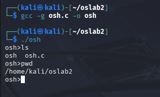
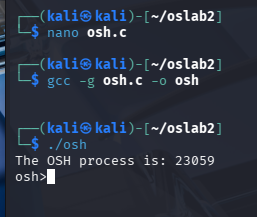
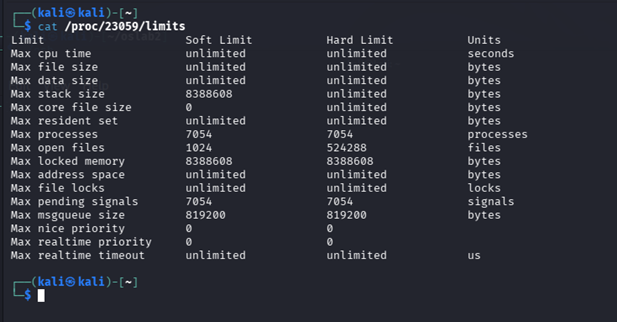
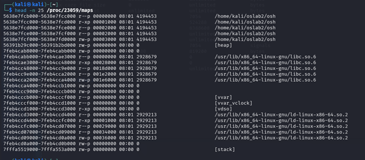
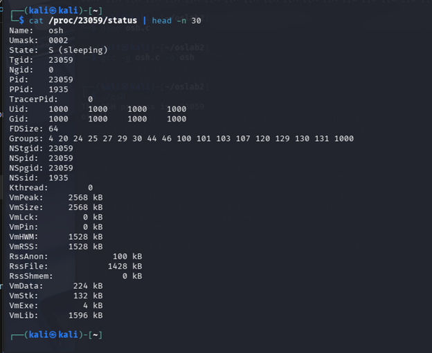

# Mini Linux Shell (Process Management)

This project is a small “mini shell” program that can run other programs and manage them.
It’s meant to practice core Linux process concepts: starting programs, waiting for completion, and inspecting process details via `/proc` to understand how command execution works under the hood.

## What this project demonstrates
- Creating a child process with `fork()`
- Running commands with `execvp()`
- Waiting for completion with `wait()` / `waitpid()`
- Basic command parsing (command + arguments)
- Inspecting a running process using Linux `/proc`

## Project structure
- `src/osh.c` — the mini shell implementation
- `screenshots/` — screenshots used in this README

## Build & run
```bash
cd src
gcc -g osh.c -o osh
./osh
```

## Screenshots

### Shell running commands (`ls`, `pwd`)


### OSH prints its PID


### `/proc/23059/limits`


### `/proc/23059/maps` (first 25 lines)


### `/proc/23059/status` (first 30 lines)

